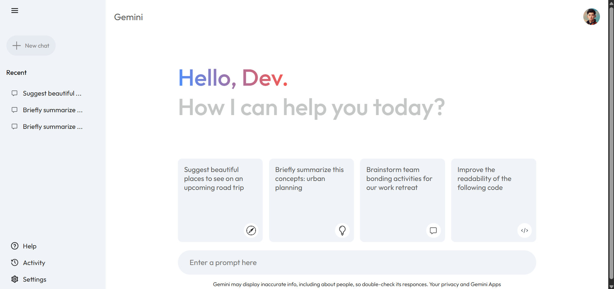

# Gemini Clone

This project is a clone of the Gemini interface, utilizing the Gemini API to replicate its functionality.

## Features

- **User Interface Clone**: The project replicates the look and feel of the original Gemini interface.
- **Text Input and Request Handling**:
  - Users can enter text in the search box.
  - The "Send" button will appear once text is entered.
  - Clicking the "Send" button will send the request to the Gemini API.
- **Basic Responsiveness**: The UI is optimized for mobile devices.

## Installation

1. Clone the repository:
   ```sh
   git clone https://github.com/vanthuan168/gemini-clone.git
   ```
2. Navigate to the project directory:
   ```sh
   cd gemini-clone
   ```
3. Install dependencies:
   ```sh
   npm install
   ```
4. Set up environment variables:
   - Create a `.env` file in the root directory.
   - Add the following line to store your Gemini API key:
     ```sh
     VITE_API_KEY=<your_api_key_here>
     ```

## Usage

1. Start the application:
   ```sh
   npm run dev
   ```
2. Open the application in your browser.
3. Enter text in the search box and click the "Send" button to interact with the Gemini API.

## Technologies Used

- **Frontend**: React.js, HTML, CSS
- **API**: Gemini API
- **Styling**: CSS 

## Future Improvements

- Enhanced mobile responsiveness
- Better error handling for API requests
- UI/UX improvements
- Implementing additional Gemini API features


